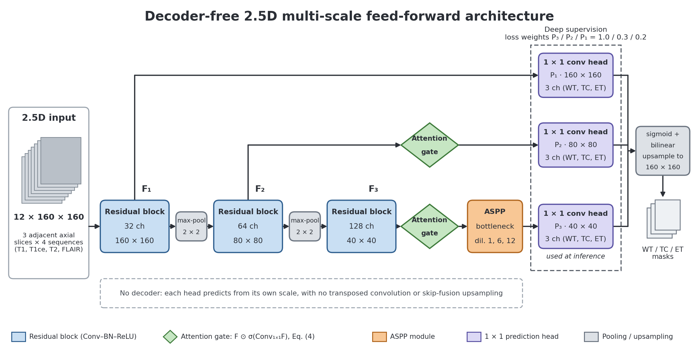

# Decoder-Free 2.5D Brain Tumor Segmentation

Code for the paper

> **Decoder-Free 2.5D Brain Tumor Segmentation: Balanced Sampling and a Hybrid Loss Eliminate Post-processing on BraTS 2021**
> S M Tanvir Hassan Shovon, Abu Shufian, Protik Parvez Sheikh, Sadman Shahriar Alam, Md. Shaoran Sayem
> Department of EEE, American International University-Bangladesh (AIUB). Manuscript under review.

The model segments the whole tumour (WT), tumour core (TC) and enhancing tumour (ET) jointly from 2.5D input: three adjacent axial slices of T1, T1ce, T2 and FLAIR, stacked as 12 channels. It has no decoder. Three 1 × 1 heads predict directly from the encoder features at three scales (deep supervision), and the deepest head is used at inference. Training combines balanced slice sampling (25% tumour-free slices) with a hybrid Dice + weighted BCE + focal loss. No post-processing is applied.

<p align="center"></p>

## Contents

```
bt25d/                     the method as a small Python package
  model.py                 decoder-free network and the encoder-decoder variant
  losses.py                hybrid loss with deep supervision
  data.py                  2.5D input construction, balanced slice sampling, dataset
  metrics.py               Dice, HD95, sensitivity, specificity, precision
  evaluation.py            whole-volume validation and evaluation
  geometry.py              native grid <-> model grid mapping
  augment.py               augmentation (ablation only)
  baselines.py             2D U-Net / Attention U-Net for the complexity comparison
  complexity.py            parameter and MAC/FLOP counting
scripts/
  preprocess.py            BraTS NIfTI -> preprocessed arrays
  make_split.py            subject-level train / validation / test split
  train.py                 training with per-epoch validation and threshold selection
  evaluate.py              full-volume evaluation of a checkpoint on a split
  lcc_analysis.py          largest-connected-component study with Wilcoxon test
  summarize_seeds.py       mean ± SD across the three final seeds
  benchmark.py             parameters, FLOPs, inference time, GPU memory
  run_experiments.py       runs every experiment group of the paper
  predict.py               segment new subjects and write NIfTI label maps
  check_checkpoint.py      verify that weights match the model code
  package_weights.py       wrap weights with their threshold and config for release
configs/                   proposed, final, encoder-decoder, single-task and all ablation configs
splits/                    subject lists (train / validation / test)
weights/                   trained weights
tests/                     unit tests and an end-to-end test on synthetic data
legacy/                    first single-task prototype (superseded, kept for reference)
```

## Installation

Python 3.9 or newer. Install PyTorch (2.1 or newer) for your CUDA version from [pytorch.org](https://pytorch.org/get-started/locally/), then:

```bash
git clone https://github.com/thshovon1/2.5D-BrainTumor-Segmentation.git
cd 2.5D-BrainTumor-Segmentation
pip install -r requirements.txt
python -m pytest -q          # optional: about 30 s on CPU, no data needed
```

## Data

The experiments use the BraTS 2021 training set (1,251 subjects) from the RSNA-ASNR-MICCAI BraTS 2021 Challenge ([braintumorsegmentation.org](http://braintumorsegmentation.org/), [Synapse](https://www.synapse.org/#!Synapse:syn25829067/wiki/610863)). The data are not included here and are subject to the challenge's terms of use. Extract the archive so that each subject has its own folder:

```
BraTS2021_Training_Data/BraTS2021_00000/BraTS2021_00000_{t1,t1ce,t2,flair,seg}.nii.gz
```

## Quick start

All commands are run from the repository root.

```bash
# 1. Preprocess: z-score per sequence inside the brain, resize 240x240 -> 160x160 (1.5 mm pixels)
python scripts/preprocess.py --raw-dir /path/to/BraTS2021_Training_Data --out-dir data/processed --workers 8

# 2. Subject-level split: 1,001 development-training / 250 validation, then 150 test drawn from
#    the development-training subjects -> 851 training subjects
python scripts/make_split.py --data-dir data/processed --splits-dir splits

# 3. Train the proposed configuration (checkpoint and threshold selected on validation)
python scripts/train.py --config configs/proposed.yaml --out-dir runs/dev/proposed

# 4. Evaluate on complete validation volumes
python scripts/evaluate.py --checkpoint runs/dev/proposed/best.pth --split val --out-dir results/val
```

Preprocessing all subjects needs about 40 GB of disk. Settings can be overridden without editing files, for example `--set training.batch_size=16 training.num_workers=8`.

## Reproducing the paper

| Paper | What it reports | How to reproduce |
|---|---|---|
| Table 4 | validation performance (N = 250) | train with `configs/proposed.yaml` (Quick start, step 3), then `python scripts/evaluate.py --checkpoint runs/dev/proposed/best.pth --split val --out-dir results/val`; Dice, sensitivity, specificity and precision are the pooled values, HD95 is the per-case mean |
| Table 5 | held-out test, 3 seeds (N = 150) | `python scripts/run_experiments.py --groups final` (trains seeds 2026-2028 on the 851 training subjects, evaluates each once on the test split, writes `results/test/table5.md`) |
| Tables 7-11 | ablations (validation Macro-Dice) | `python scripts/run_experiments.py --groups loss heads rho weights augment` |
| Tables 12-13 | LCC post-processing study | `python scripts/evaluate.py --checkpoint runs/dev/proposed/best.pth --split val --save-preds --out-dir results/val`, then `python scripts/lcc_analysis.py --pred-dir results/val/preds --out-dir results/val_lcc` |
| Table 14 | decoder-free vs encoder-decoder | `python scripts/run_experiments.py --groups decoder` and `python scripts/benchmark.py --archs decoder_free encoder_decoder` |
| Tables 15-16 | inference benchmark, model complexity | `python scripts/benchmark.py --data-dir data/processed --subject BraTS2021_00000 --repeats 20` |

`summarize_seeds.py` combines the three test runs. It uses pooled Dice, sensitivity and specificity per seed by default; `--aggregate per_case` uses per-subject means instead. HD95 is always the per-case mean.

The single-task WT analysis in Section 4.3 of the paper (Table A1, Figures 4-6 and 8) was produced with the prototype notebook in `legacy/`. `python scripts/run_experiments.py --groups single_task` trains the same one-channel model with the current pipeline, and its `history.csv` gives the validation Dice at every threshold and epoch.

`run_experiments.py --dry-run` prints every command without running it, and `--collect-only` rebuilds the result tables in `results/` from finished runs. Each ablation is a single run. The paper treats differences below about 0.5 percentage points as within run-to-run variation.

In the loss-component ablation (Table 7), a removed term gets weight 0 and the remaining terms keep their weights from the proposed configuration.

## Using the trained weights

The released weights are in `weights/` (see [weights/README.md](weights/README.md)). Each checkpoint stores the decision threshold selected on the validation split. Evaluate them on the test subjects listed in `splits/`, which are the subjects these weights were not trained on. A split regenerated on another machine could include training subjects of the released weights.

```bash
# segment new subjects (BraTS folder layout); writes <id>_pred.nii.gz with labels 1, 2, 4
python scripts/predict.py --checkpoint weights/decoder_free_seed2026.pth --inputs /path/to/BraTS2021_00000 --out-dir predictions

# evaluate on the held-out test split
python scripts/evaluate.py --checkpoint weights/decoder_free_seed2026.pth --split test --out-dir results/test/seed2026
```

In Python:

```python
import torch
from bt25d.model import build_model, infer_model_config, read_checkpoint

state, meta = read_checkpoint("weights/decoder_free_seed2026.pth")
model = build_model(infer_model_config(state))
model.load_state_dict(state)
model.eval()
p3, p2, p1 = model(torch.randn(1, 12, 160, 160))   # logits; P3 is the inference output
masks = torch.sigmoid(p3) > torch.tensor(meta["threshold"]).view(1, -1, 1, 1)   # WT, TC, ET
```

## Method and evaluation details

**Input.** For axial slice *i*, slices *i−1*, *i*, *i+1* of the four sequences are concatenated in the order [previous (T1, T1ce, T2, FLAIR), current, next]. At the first and last slice the missing neighbour is all zeros.

**Targets.** WT = labels {1, 2, 4}, TC = {1, 4}, ET = {4}. Label 3 is also read as ET, for data that use the later BraTS convention.

**Balanced sampling.** All tumour-present slices of the training subjects are kept. Then n<sub>e</sub> = ⌊|D<sub>t</sub>| · ρ / (1 − ρ)⌋ tumour-free slices are drawn once, with a fixed seed, before training (ρ = 0.25).

**Loss.** For each head, 0.5 Dice + 0.3 weighted BCE (positive weight 2) + 0.2 focal (α = 0.8, γ = 2), averaged over the WT, TC and ET channels. The heads are weighted 1.0 / 0.3 / 0.2 for P3 / P2 / P1.

**Optimisation.** Adam with lr 3 × 10⁻⁴ and cosine annealing over the whole run, stepped once per epoch. Batch size 32, 10 epochs, FP16 mixed precision, no augmentation.

**Model selection.** After every epoch, the complete validation volumes are segmented and the pooled Dice is computed for each region at thresholds {0.3, 0.4, 0.5, 0.6}. The epoch and the single global threshold with the highest validation Macro-Dice are kept. The test set is never used for any choice.

**Metrics** (`bt25d/metrics.py`). Metrics are computed per region on complete, reassembled volumes.
* Dice is 1 when prediction and reference are both empty and 0 when exactly one is empty.
* HD95 is the larger of the two directed 95th-percentile surface distances, in mm. By default it is computed on the model grid (1 mm × 1.5 mm × 1.5 mm voxels). `--grid native` maps probabilities back to the original 240 × 240 grid first.
* When both masks are empty, HD95 is 0. When only one is empty, HD95 is undefined; such cases are excluded from the mean and counted in the summary. `--hd95-empty-penalty 373.13` applies the BraTS convention instead.
* Sensitivity is undefined when the reference is empty, and precision when the prediction is empty.
* *Pooled* values sum TP/FP/FN/TN over all voxels of a split. *Per-case* values are means over subjects. `evaluate.py` reports both.
* Standard deviations across seeds use ddof = 1.

**LCC study.** The largest 3D connected component is kept (26-connectivity by default). Per-case Dice changes are tested with a paired Wilcoxon signed-rank test. Cases are stratified by the number of connected components in the reference WT mask.

**Complexity.** `python scripts/benchmark.py --no-timing` prints parameters, MACs and FLOPs per 12 × 160 × 160 slice for the proposed model, the encoder-decoder variant and the 2D U-Net / Attention U-Net baselines (32 base filters). FLOPs are reported as 2 × MACs, which matches PyTorch's own FLOP counter. Some tools, such as thop and ptflops, report MACs under the name "FLOPs".

## Results reported in the paper

Held-out test set (N = 150 subjects never used for training or model selection), mean ± SD over three training seeds, without post-processing:

| Region | Dice | HD95 (mm) |
|---|---|---|
| WT | 0.8897 ± 0.0026 | 6.21 ± 0.19 |
| TC | 0.7982 ± 0.0032 | 8.26 ± 0.18 |
| ET | 0.7313 ± 0.0050 | 13.42 ± 0.44 |
| Macro | 0.8064 ± 0.0036 | |

On the development validation split (N = 250, used for model selection), Dice was 0.9068 (WT), 0.8187 (TC) and 0.7629 (ET), for a Macro-Dice of 0.8295. Numbers from new runs will differ slightly with hardware, library versions and the subject split.

## Subject split

`make_split.py` builds the split from fixed seeds. It checks that the training, validation and test subject sets do not overlap, and stops if they do. The lists are written to `splits/`. See [splits/README.md](splits/README.md).

## Legacy code

`legacy/` contains the first single-task WT prototype: the original notebook, an early preprocessing script and the prototype's weights. The prototype predicted WT only and used its own data files and split. It is kept for reference and is superseded by the code above. See [legacy/README.md](legacy/README.md).

## Citation

If you use this code, please cite the paper (citation details will be added on publication):

```bibtex
@unpublished{shovon2026decoderfree,
  title  = {Decoder-Free 2.5D Brain Tumor Segmentation: Balanced Sampling and a Hybrid Loss Eliminate Post-processing on BraTS 2021},
  author = {Shovon, S M Tanvir Hassan and Shufian, Abu and Sheikh, Protik Parvez and Alam, Sadman Shahriar and Sayem, Md. Shaoran},
  note   = {Manuscript under review},
  year   = {2026}
}
```

## License

MIT License, see [LICENSE](LICENSE). The BraTS 2021 data have their own terms of use.

## Acknowledgements

We thank the organisers of the BraTS 2021 challenge for the dataset. This work was carried out at American International University-Bangladesh (AIUB).
